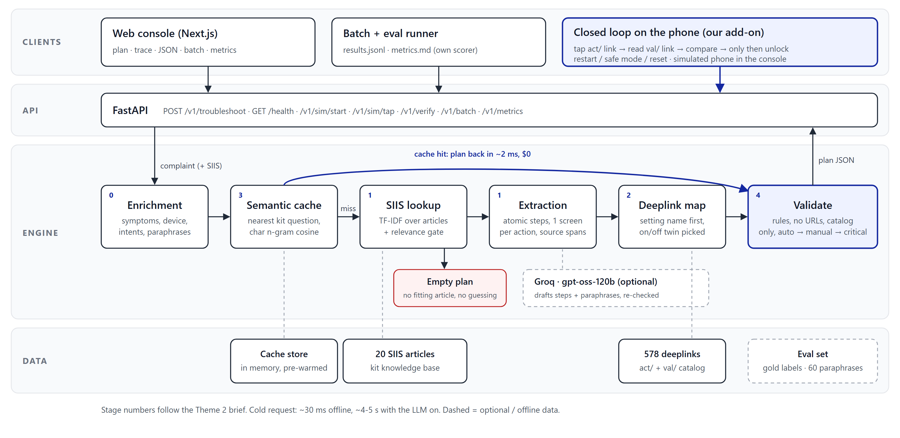

# Smart Guided Troubleshooting Engine

Samsung PRISM Generative AI Hackathon, Theme 2. Team Brutal Bruteforcers, MSRIT.

Customers describe phone problems vaguely ("my screen is laggy after the update"). This project turns that
complaint into an ordered troubleshooting plan where every Settings step has a one-tap deeplink from the kit
catalog. It also checks that a fix really worked by reading the setting back through its validation deeplink.



## How it works

1. **Enrichment** - normalises the complaint, detects symptoms and device, splits messages that contain several complaints.
2. **Semantic cache** - a close rewording of a known complaint is answered straight from memory (a few ms, no model call).
3. **SIIS lookup** - on a cache miss, finds the best help article. If nothing fits, it returns an empty plan (`no_match`) instead of guessing.
4. **Extraction** - turns the article into atomic steps, one screen per action. Each step keeps the sentence it came from.
5. **Deeplink mapping** - matches each Settings step to its catalog screen (setting name first, then TF-IDF over descriptions) and picks the right on/off twin.
6. **Validation** - enforces the brief's rules (field syntax, no URLs, catalog-only links) and orders the plan auto, then manual, then critical.
7. **Closed loop** - taps the link on a simulated phone, reads the setting back and compares it with the expected value. Restart, safe mode and reset only unlock after that.

Groq (`openai/gpt-oss-120b`) is optional. It can draft the steps and the paraphrases, but its output goes through the same checks and any failure falls back to the offline path.

## Requirements

- Python 3.11 or newer
- Node.js 20 or newer (only for the web console)

## Setup

From the project folder:

```bash
python -m pip install -r requirements.txt
cd web
npm install
cd ..
```

## Run it

Open two terminals in the project folder.

**Terminal 1 - the engine (API on port 8765):**

```bash
python -m uvicorn app:app --host 127.0.0.1 --port 8765
```

Wait for `Application startup complete`. You can check it at http://127.0.0.1:8765/health.

**Terminal 2 - the web console (port 43123):**

```bash
cd web
npm run dev
```

Open http://localhost:43123. The console proxies `/v1/*` to the engine. If the engine runs somewhere else, set
`ENGINE_URL` before starting it, for example `ENGINE_URL=http://127.0.0.1:8766`.

### Using the console

- **Troubleshoot** - pick a kit complaint (or type one), press *Build plan*, then *Run safe steps* to watch the phone simulator confirm each fix. The *Trace* tab shows the source sentence for every step, and *JSON* shows the exact API output.
- **Batch run** - runs all 20 complaints from `data/input.txt` and lets you download `results.jsonl`.
- **Metrics** - before/after numbers from `eval/`.
- **Gaps & innovation** - what the brief leaves open and what we added.

## Optional: turn on Groq

The engine works fully offline with no key. To try the LLM path, copy the example file and add your key:

```bash
copy .env.example .env      # Windows
cp .env.example .env        # macOS / Linux
```

Then edit `.env`:

```
GROQ_API_KEY=your_key_here
GROQ_MODEL=openai/gpt-oss-120b
```

`.env` is ignored by git, so your key is never pushed. `ENGINE_DISABLE_LLM=1` forces the offline path. On Groq's free
tier, batches hit rate limits and fall back to offline for the rest, which is why the headline numbers below are offline.

## API

`POST /v1/troubleshoot`

```json
{ "query": "phone swipe gestures wrong direction after app install", "siis_response": null }
```

`siis_response` is optional (the kit's `{title, content}` object or plain text). Add `?trace=1` to also get stage
timings, retrieval candidates and the source span of every step. The response follows `data/schema.py`:
`query`, `query_variations`, `response.contexts[]` and a `meta` block (`latency_ms`, `cache_hit`, `model`, `cost_usd`, `fallback`).

`GET /health` returns `{"status": "ok", ...}` once the catalog, articles and cache are loaded.

The console also uses `/v1/examples`, `/v1/siis`, `/v1/batch`, `/v1/metrics`, `/v1/sim/start`, `/v1/sim/tap` and `/v1/verify`.

## Tests and metrics

```bash
python -m pytest -q                      # contract, mapping, cache, verification and API tests
python scripts/run_batch.py --samples    # writes results.jsonl and refreshes data/samples/
python eval/run_metrics.py               # offline metrics -> metrics.md + eval/metrics.json
python eval/run_metrics.py --mode llm    # same scorer with Groq on (needs a key) -> eval/metrics_llm.json
```

The scorer in `eval/run_metrics.py` does not reuse the engine's own validators. It checks the brief's rules separately,
against hand-labelled expectations in `eval/gold.json` and 60 rephrasings we wrote in `eval/paraphrases.json`.

## Results

Same scorer on the original starter engine (before) and on this one (after), offline. Full tables are in [metrics.md](metrics.md).

| Metric | Before | After |
| :--- | :--- | :--- |
| Rule compliance (goal, title, description, names) | 5.0% | 100% |
| Deeplink lands on the exact screen (0-2) | 0.03 | 2.0 |
| Step accuracy vs gold labels (0-3) | 2.74 | 2.94 |
| Cache hits on 60 unseen rephrasings | 0% | 86.7% |
| Linked steps that can be verified afterwards | 0% | 42.9% |
| Schema-valid responses, URL leaks, catalog-valid links | 100%, 0, 100% | 100%, 0, 100% |

Latency (offline): a new complaint takes about 30 ms (P95 110 ms), a cache hit about 1 ms (P95 2 ms).

Known limits: 11.7% of rephrasings reach a plan from a neighbouring article, a few kit complaints only come with loosely
related articles, and the phone in the closed loop is a simulator, not a real device.

## Project layout

```
app.py              starts the FastAPI app
schema.py           public schema (same as data/schema.py)
engine/             the engine: pipeline, extraction, catalog, cache, validation, verification, optional Groq client
data/               the Theme 2 kit: deeplink catalog, SIIS articles, input.txt, sample outputs
eval/               tests, gold labels, paraphrases, metrics scripts and their JSON output
scripts/            run_batch.py (results.jsonl), build_deck.py (fills the presentation)
web/                Next.js console
docs/               diagrams and screenshots used in this README and the slides
results.jsonl       engine output for all 20 kit complaints
metrics.md          the performance report from the brief (Appendix C)
```

## Submission

- Presentation: `MSRIT_Brutal Bruteforcers_Submission.pptx`
- Demo video: https://youtu.be/HOXW_BEBL_s?si=IO7VcwSyDsOQ5F-9
